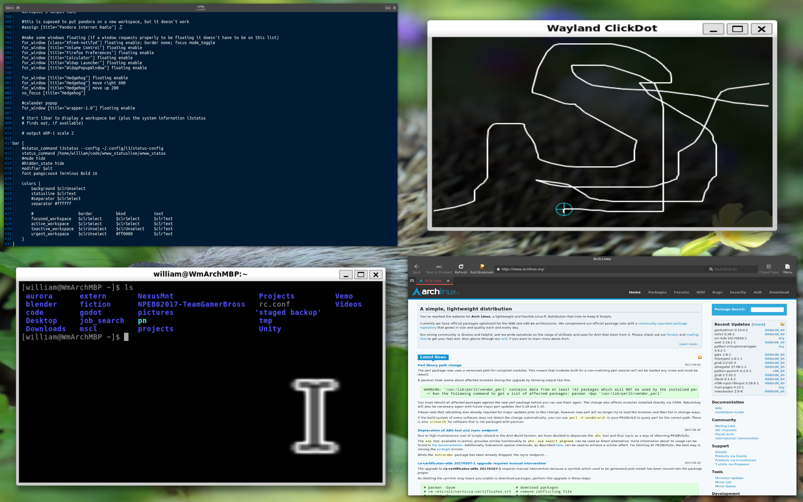

# Hedgehog Wayland compositor

Hedgehog is an incomplete Wayland compositor written in C++. It uses libwayland directly, rather then a library such as weston or wlc. It currently has X11 and DRM backends (switchable at compile time from the top of main/main.cpp). It works well enough to be able to run and use weston and GTK3 apps within it, though some things are still missing, such as subsurfaces. The future of this compositor is unclear, as I intend to focus my energy on building a compositor in Rust going forward, and it makes more sense to use and contribute to a somewhat established library (such as [smithay](https://github.com/Smithay/smithay)) then continue developing my own.

